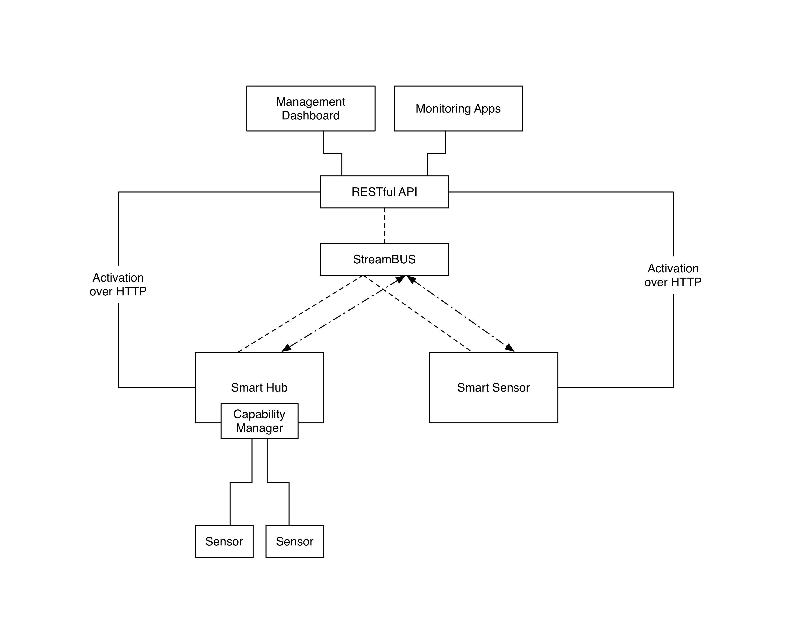

Management Dashboard
====================

This repository contains the beginnings of the device API and the Management Dashboard.
It is built using the following open source technologies:

*Frontent Dashboard*
- AngularJS (inc. Restangular, MomentJS)
- Bower & NPM (dependency management)
- Twitter Bootstrap (UI and CSS template)
- GulpJS (Build tool)
- Socket.IO (Commuication over websockets)

*API Backend*
- PostgreSQL (Industry standard RDMS)
- Python Flask (Web Framework)
- SQLAlchemy (Flexible python ORM)
- Socket.IO (Commuication over websockets)

This is only very much in its early stages of development.

As part of the 2014 Telstra M2M Challenge the QUT team has designed a modular m2m ecosystem using industry best practice drawing upon elements of modern web applications, security considerations and connectivity considerations with a focus on simplicicty for the end user.

